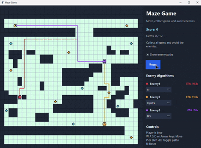

# Maze Python

Simple Python rebuild of the Godot maze project.

Run it with:

```powershell
python app.py
```
## Demo



Controls:
- `WASD` or arrow keys: move
- `D`: toggle enemy path display
- `R`: reset